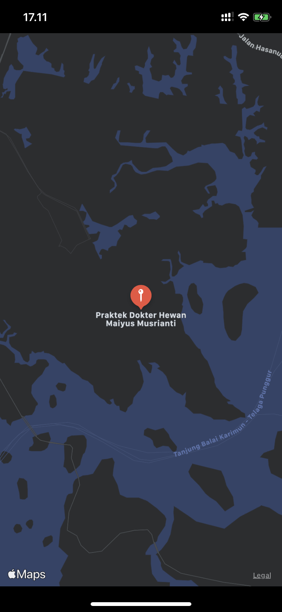

# MapKit_01_MKPointAnnotation_MKCoordinateRegion
MKPointAnnotation, MKCoordinateRegion learn from [Adding Pins To A Map - iOS MapKit Swift 5 Xcode Tutorial](https://www.youtube.com/watch?v=Hn_MGvuYZdg)

